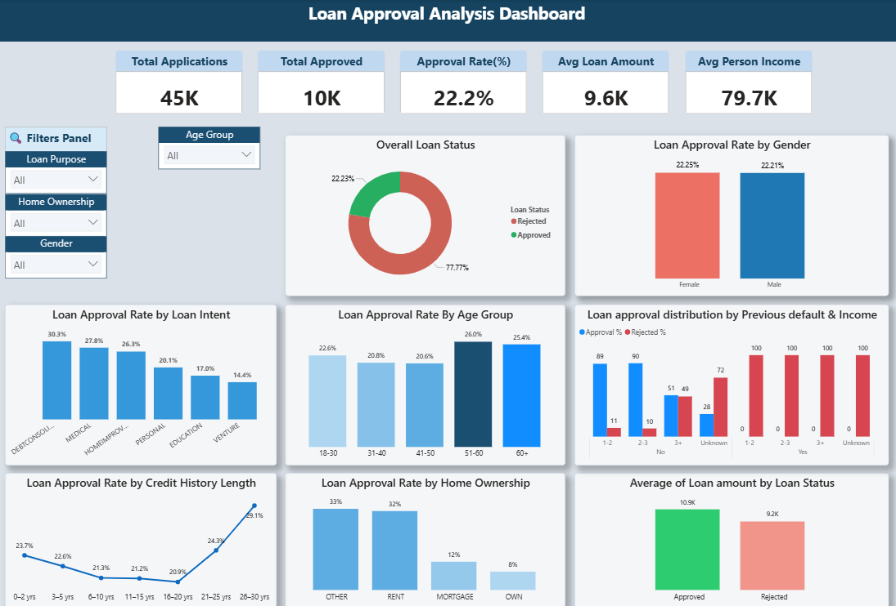

# 📊 Loan Approval Analysis

## 🏦 Business Problem

Banks and financial institutions receive thousands of loan applications, but approving loans without proper risk evaluation can lead to repayment failures and financial losses.

The main challenge is identifying reliable applicants while minimizing lending risk.

This project analyzes applicant financial and demographic data to understand which factors most strongly influence loan approval decisions, repayment behavior, and overall lending risk.

---

## 📌 Project Overview

This project performs **Exploratory Data Analysis (EDA)** on a loan approval dataset to understand the key factors influencing loan approval decisions.

The analysis focuses on identifying patterns in applicant characteristics such as income, age, education, employment experience, loan intent, home ownership, credit history, and previous loan defaults.

The goal is to extract **business insights that explain how financial and demographic factors impact loan approval outcomes.**

---

## 📂 Dataset Description

The dataset contains information about loan applicants and their application details.

### Key Columns:
- Gender  
- Age  
- Education  
- Employment Experience  
- Home Ownership  
- Income  
- Loan Amount  
- Loan Intent  
- Previous Loan Defaults  
- Credit History Length  
- Loan Status (Approved / Rejected)  

---

## 🛠 Tools and Libraries Used

- Python  
- Pandas  
- NumPy  
- Matplotlib  
- Seaborn  
- Jupyter Notebook  
- Power BI  

---

## 🔄 Project Workflow

### 1. Data Loading
- Dataset loaded using Pandas  
- Initial structure and column types explored  

### 2. Data Cleaning
- Renamed columns for clarity  
- Checked missing values  
- Verified data types  
- Reviewed categorical variables  
- Removed unrealistic age values  
- Applied log transformation to reduce income skewness  

### 3. Exploratory Data Analysis (EDA)
- Distribution analysis of numerical variables  
- Group-based analysis for categorical variables  
- Aggregations and summary statistics  
- Outlier analysis using boxplots  

### 4. Feature Engineering
Created and analyzed:
- Income-to-loan ratio groups  
- Age groups  
- Employment experience groups  
- Credit history ranges  

### 5. Data Visualization
- Overall Loan Approval vs Rejection  
- Loan Approval by Gender  
- Loan Approval by Age Group  
- Loan Approval by Education Level  
- Loan Approval by Employment Experience  
- Loan Approval by Home Ownership  
- Loan Approval by Loan Intent  
- Loan Approval by Previous Defaults & Income Ratio  
- Credit History Length vs Approval Rate  
- Average Loan Amount by Loan Intent  
- Average Loan Amount by Loan Status  

---

## 🔍 Key Insights

- Overall approval rate is **22.23%**, while **77.77% of applications are rejected**, indicating strict lending criteria.  

- Loan approval is **almost identical across genders**, showing a relatively balanced approval process.  

- Older applicants (51+) show slightly higher approval rates (~25–26%), suggesting stronger financial stability and repayment reliability.  

- Home ownership impacts approval:
  - Renters → higher approval rates  
  - Owned/Mortgage → lower approval rates  

- **Previous loan defaults are the strongest rejection factor**, with nearly 0% approval across all categories.  

- For non-defaulters, **income-to-loan ratio strongly affects approval**, with extreme ratios (3+) showing lower approval rates and increased financial risk.  

- Loan purpose impacts approval:
  - Higher approval → Debt Consolidation, Medical, Home Improvement  
  - Lower approval → Personal, Education, Venture  

- Credit history length positively influences approval probability, suggesting that longer repayment history improves lender confidence.  

- Loan amounts vary by purpose, with higher averages for investment and business-related loan categories.  

---

## 💼 Business Impact

This analysis can help banks and financial institutions better understand applicant risk patterns and improve loan approval decision-making.

By identifying key factors such as previous loan defaults, income-to-loan ratio, credit history, and loan purpose, lenders can reduce repayment risk and make more data-driven lending decisions.

The insights from this project can also help improve customer risk evaluation and support more efficient financial screening processes.

---

## 📊 Power BI Dashboard

- Created interactive dashboard for loan approval analysis  
- Visualized key business insights from Python EDA  
- Helps understand approval trends across multiple factors  

📌 Dashboard Screenshot: (added in repo)  
📌 File: `Loan_Approval_Dashboard.pbix`

---

## 📁 Project Files

- `Loan_Approval_Analysis.ipynb` – Full analysis notebook  
- `loan_dataset.csv` – Source dataset  
- `charts/` – Saved visualizations  
- `Loan_Approval_Dashboard.pbix` – Power BI dashboard  

---

## 📌 Key Takeaway

Loan approval decisions are primarily driven by **credit risk factors**, especially previous defaults, followed by income stability, loan purpose, and financial behavior patterns.

---

## 👤 Author

**Avinash Reddy**  

This project is part of my Data Analyst learning journey focused on Python-based EDA, dashboard storytelling, and business insight generation.
